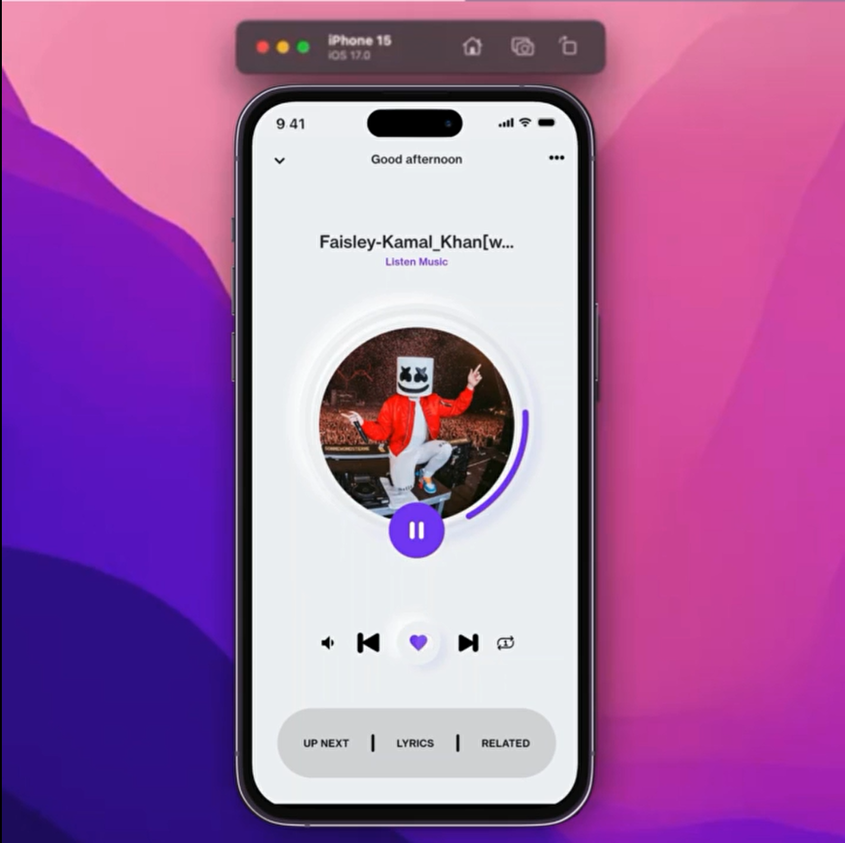

# Flutter Music App with BLoC

A Flutter music streaming application that allows users to play audio files from local storage. The app features a beautiful neumorphic UI design and provides a smooth user experience for browsing and playing music.

## Screenshots

Include some attractive screenshots of your app to give potential users a visual preview of your project's interface.

**Immerse yourself in your music with this beautiful and intuitive Flutter app!**

**Features:**

* **Effortless browsing:** Explore your music library with ease.
* **Stunning design:** Experience a captivating neumorphic UI.
* **Seamless playback:** Enjoy smooth audio control and playback.
* **Personalized favorites:** Create playlists and mark your favorites for quick access.
* **Responsive experience:** BLoC ensures a fluid and reactive app.

**Key Technologies:**

* **Flutter:** Cross-platform development for flexibility.
* **BLoC:** State management for a responsive experience.
* **Neumorphic design:** Modern and elegant look.
* **Just Audio:** Powerful audio playback engine.

**Get Started:**

1. **Clone the repository:** `git clone https://github.com/Hamad-Anwar/Flutter-Music-Player-App-With-BLoc.git`
2. **Install dependencies:** `flutter pub get`
3. **Connect your device or start an emulator.**
4. **Run the app:** `flutter run`

### Dependencies

This project uses the following dependencies:

* shared_preferences: For storing user preferences.
* bloc: Core BLoC library for state management.
* flutter_bloc: BLoC integration with Flutter widgets.
* equatable: Simplifies object comparison for BLoC.
* google_fonts: Access a wide variety of fonts for customization.
* flutter_svg: Display and interact with SVG icons and images.
* sqflite: SQLite database for persistent data storage.
* path_provider: Provides access to device file system paths.
* path: Utilities for handling file and directory paths.
* permission_handler: Requests and manages runtime permissions.
* just_audio: Powerful audio player for Flutter applications.
* on_audio_query: Fetches and organizes audio files from device storage.
* layout_pro: Advanced layout capabilities for complex UI structures.
* shimmer_effect: Create shimmering loading animations for a polished look.
  
**Contribute & Connect:**

* **Report bugs or share ideas:** Submit pull requests or open issues.
* **Join the community:** Get updates and engage with other developers.

**Spread the Music:**

* **Star the project on GitHub if you like it!**
* **Share with your friends and music lovers.**

**Let the music flow!**

