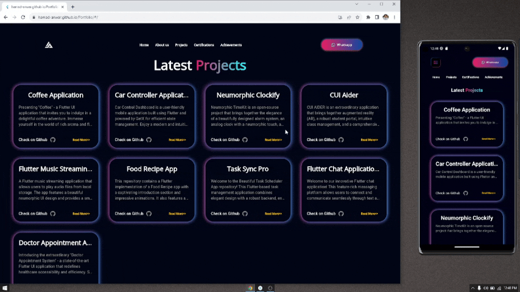

# Draggable Widget

The **draggable_widget** package empowers Flutter developers to effortlessly make any widget draggable within their applications, providing them with a seamless and customizable drag-and-drop experience.

## Features
- Drag and drop any widget with ease.
- Customize initial position using various options such as center, topCenter, leftCenter, rightCenter, bottomCenter, topRightCorner, bottomRightCorner, topLeftCorner, bottomLeftCorner, or custom coordinates.
- Adjust drag speed to control movement fluidity.
- Simple and intuitive API for easy integration.

## Demo
Check out the package in action with this.


## Installation
To integrate **draggable_widget** into your Flutter project, add the package to your `pubspec.yaml` file:

## Usage
```yaml
dependencies:
  flutter_draggable_widget: ^latest_version

```dart
import 'package:draggable_widget/draggable_widget.dart';
DraggableWidget(
  height: 100,
  width: 100,
  dragSpeed: 3,
  initialPosition: InitialPosition.topCenter,
  widget: Container(
    // Your widget here
  ),
)
```
## Customization
height: Specifies the height of the draggable widget.
width: Specifies the width of the draggable widget.
dragSpeed: Controls the speed at which the widget moves when dragged (default: 3).
initialPosition: Sets the initial position of the widget. Options include:
- InitialPosition.center
- InitialPosition.topCenter
- InitialPosition.leftCenter
- InitialPosition.rightCenter
- InitialPosition.bottomCenter
- InitialPosition.topRightCorner
- InitialPosition.bottomRightCorner
- InitialPosition.topLeftCorner
- InitialPosition.bottomLeftCorner
- InitialPosition.custom(left, top): Specify custom coordinates.


## License: MIT

## Contributions
Feel free to contribute to this package! Check out the contribution guidelines in the repository.

## Feedback
Your feedback and suggestions are invaluable! Please create an issue on GitHub if you have any.
